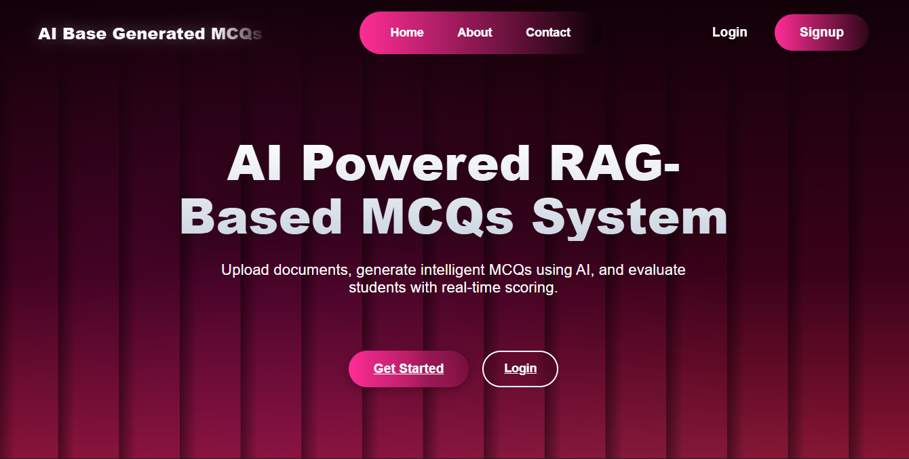
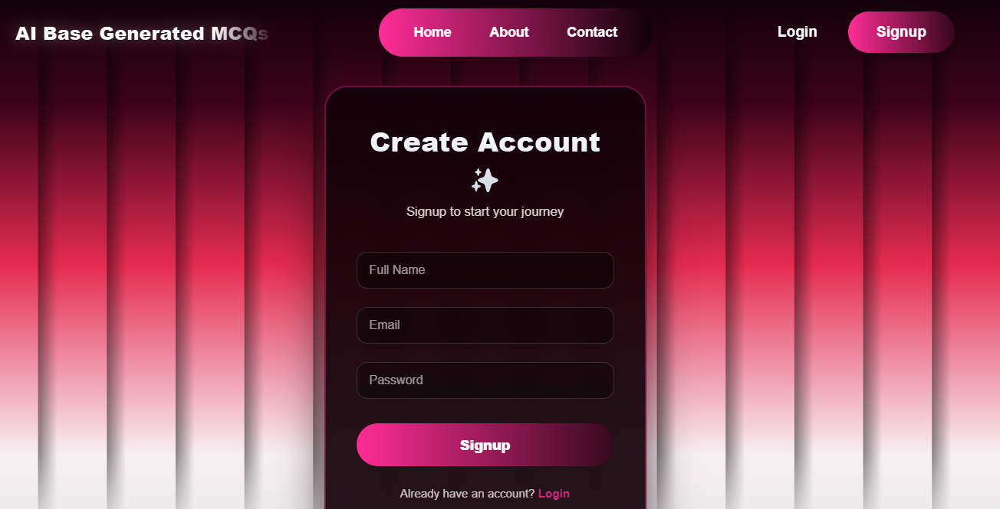
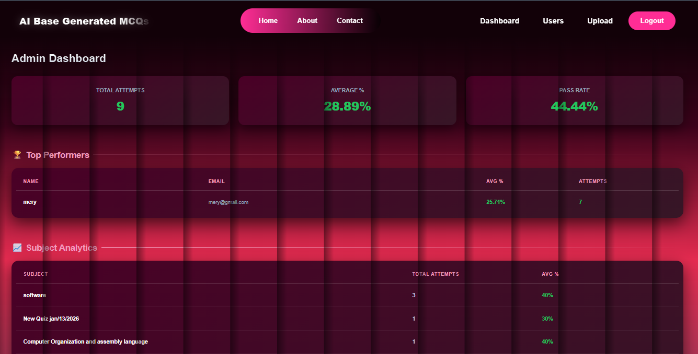
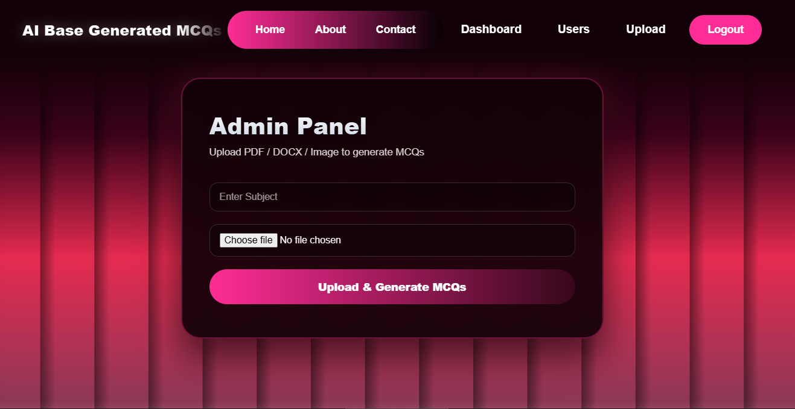
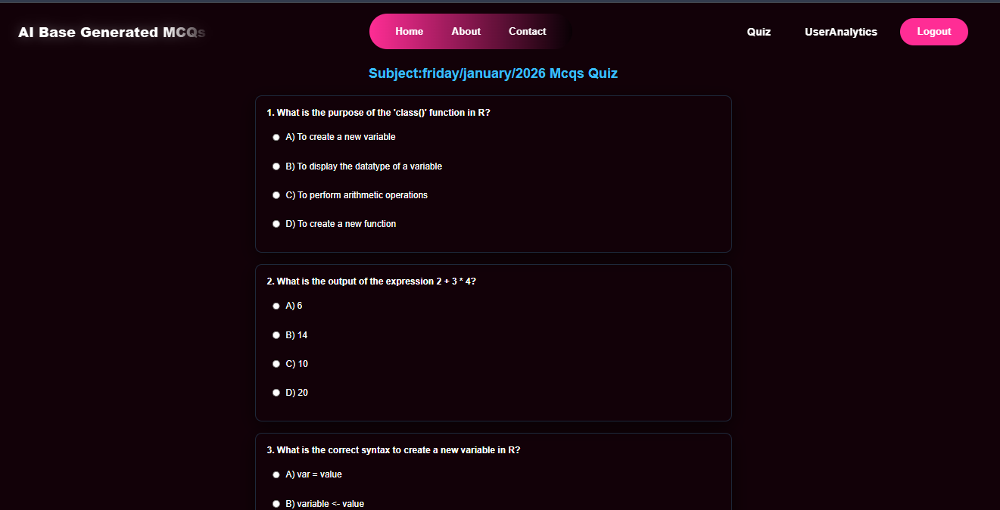
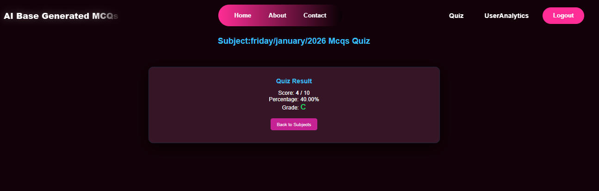
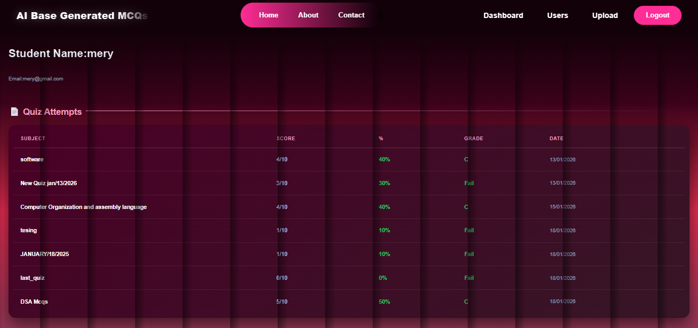

# 🤖 AGENTIC AI RAG-Based MCQs System
<!-- TECH STACK BANNERS --> <p align="center">     </p> <p align="center">    </p> <p align="center">    </p>
#  🧠 Project Overview

An AI-powered assessment platform that uses Retrieval-Augmented Generation (RAG) to automatically generate intelligent MCQs from uploaded documents and evaluate students in real time.

The system is built using a modern full-stack architecture, with a React (Vite) frontend and a FastAPI + MongoDB backend, following professional industry practices.

## 🖼 UI Screenshots & Workflow Preview
### 🏠 Home Page
<p align="center">  </p>

### 🔐 Authentication (Register & Login)
<p align="center">   </p>

### 👨‍🏫 Admin Dashboard – Upload & MCQ Generation
<p align="center">  </p>

### 📄 Document Upload (PDF / DOCX / Image)
<p align="center">  </p>

### 🎓 Student Quiz Attempt
<p align="center">  </p>

### 📊 Live Score & Evaluation
<p align="center">  </p>

### 📈 Student Progress Dashboard
<p align="center">  </p>

# 📌 Key Features
## 🔹 AI-Powered MCQ Generation

Upload PDF, DOCX, or Image files

AI extracts content using OCR & document parsers

RAG ensures questions are generated only from uploaded content

## 🔹 Secure Authentication & Roles

JWT-based authentication

Role-based access:

Admin / Teacher

Student

Protected routes using modern frontend guards

## 🔹 Real-Time Evaluation

One-time quiz attempts

Instant scoring, percentage & grading

Attempts stored securely for analytics

## 🔹 Modern UI & UX

Glassmorphism design

Smooth animations (GSAP, ScrollReveal)

Fully responsive, SaaS-level UI

## 🧠 How the System Works

Admin uploads learning material (PDF / DOCX / Image)

AI processes the content

Text extraction (PyMuPDF, Tesseract OCR)

Context retrieval using RAG

MCQ generation

Students attempt quizzes

System evaluates instantly

Results stored & displayed on dashboards

### 👥 User Roles & Responsibilities
### 👨‍🏫 Admin / Teacher

Upload documents

Generate quizzes using AI

Preview generated MCQs

Manage quiz data

### 🎓 Student

Register & log in

View available quizzes

Attempt quizzes (one attempt only)

View performance dashboard (score, percentage, grade)

# 🗂 Project Structure
```
rag_mcqs_project/
│
├── backend/
│   ├── app/
│   │   ├── models/
│   │   ├── routes/
│   │   ├── schemas/
│   │   ├── services/
│   │   ├── utils/
│   │   ├── config.py
│   │   ├── database.py
│   │   └── main.py
│   ├── uploads/
│   ├── .env
│   ├── requirements.txt
│   └── run.py
│
├── frontend/
│   ├── public/
│   ├── src/
│   │   ├── api/
│   │   ├── components/
│   │   ├── pages/
│   │   ├── store/
│   │   ├── App.jsx
│   │   └── main.jsx
│   ├── package.json
│   └── vite.config.js
│
└── README.md
```

# 🧰 Tech Stack
Frontend (React)

React 19 (Vite)

React Router v7 (Protected Routes)

Zustand (Auth & Token Management)

TanStack Query (API Fetching & Caching)

Axios

GSAP Animations

React Hot Toast

Backend (FastAPI)

FastAPI

MongoDB (Motor)

JWT Authentication (python-jose)

Password Hashing (passlib + bcrypt)

OCR & Document Processing:

PyMuPDF

python-docx

Pillow

pytesseract

# 🚀 Frontend Setup
```
cd frontend
npm install
npm run dev
```
Frontend runs at:

http://localhost:5173

# ⚙️ Backend Setup (FastAPI + MongoDB)
```
cd backend
python -m venv venv

Activate virtual environment:

Windows

venv\Scripts\activate


Linux / macOS

source venv/bin/activate


Install dependencies:

pip install -r requirements.txt


Run server:

uvicorn app.main:app --reload
```


Backend runs at:

http://127.0.0.1:8000

# 📊 Dashboards
Admin Dashboard

Upload documents

Generate MCQs

Preview quizzes

Student Dashboard

View attempted quizzes

Total attempts

Average score

Detailed progress history

# 🎯 Project Highlights

Clean separation of concerns

Scalable backend architecture

Production-level frontend state management

AI-assisted education workflow

Portfolio & university-ready

# 👨‍💻 Built By MASTER MINDS

AGENTIC AI RAG-Based MCQs System
A professional full-stack AI project combining modern frontend, scalable backend, and RAG-based intelligence.